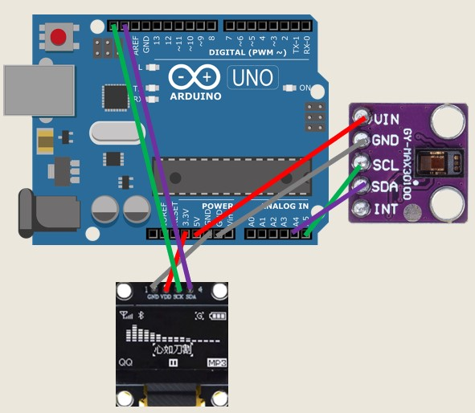
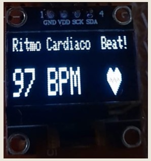
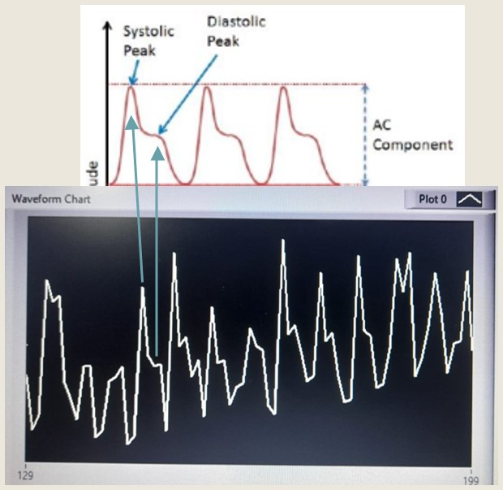

# Heart Rate Monitor (Pulsometer)

This project is a heart rate monitoring system that uses the MAX30100 optical sensor to detect pulse signals. The data is processed and displayed both on a 128x64 OLED screen and LabVIEW for real-time visualization and analysis.

## Overview

The heart operates in two main phases:

- **Systole**: contraction phase, when blood is pumped into the arteries.
- **Diastole**: relaxation phase, when the heart chambers refill with blood.

The pulsometer detects heartbeats by measuring changes in light absorption caused by the blood flow using photoplethysmography (PPG). The sensor outputs an analog signal with:

- **DC component**: due to constant absorption by tissues like skin and muscle.
- **AC component**: varies with each heartbeat, representing the pulse.

## Components

- **MAX30100 Sensor** – Optical pulse sensor using red and infrared LEDs.
- **Arduino UNO R3**
- **OLED Display (128x64)**

## Prototypes

### First Prototype

- Sensor: TCRT5000 (basic optical sensor)
- Signal conditioning filters
- LED indicator

### Second Prototype (Final)

- Sensor: MAX30100 with I2C communication
- Real-time data shown on OLED and transmitted via serial to LabVIEW
- Improved casing and structure

#### Circuit Diagram

## Software Features

### Arduino Code

- Initialization of OLED and MAX30100 sensor
- Heartbeat detection algorithm
- Real-time BPM display on OLED
- Serial communication to LabVIEW

#### OLED Screen Output

### LabVIEW

- Graphical interface to display live pulse signal

Lucas Calle, Juan Diego Arturo
